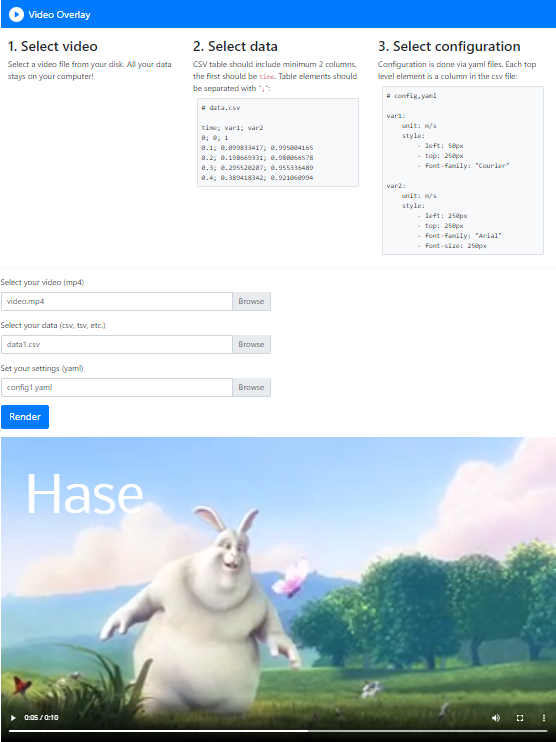

# Video overlay

Tool for rendering time dependent data on top of video (mp4) files.



## Features

- load `.csv` file with time and data columns - the data will be displayed on the according point in time
- load `.mp4` file
- load `.yaml` configuration files with CSS style properties which describe the appearance on the data columns in the `.csv` file.

## Development

Browse into `site` directory and spin up [browser-sync](https://www.browsersync.io):

```shell
browser-sync --server --files="*"
```

Main logic can be found in [site/script.js](site/script.js).
